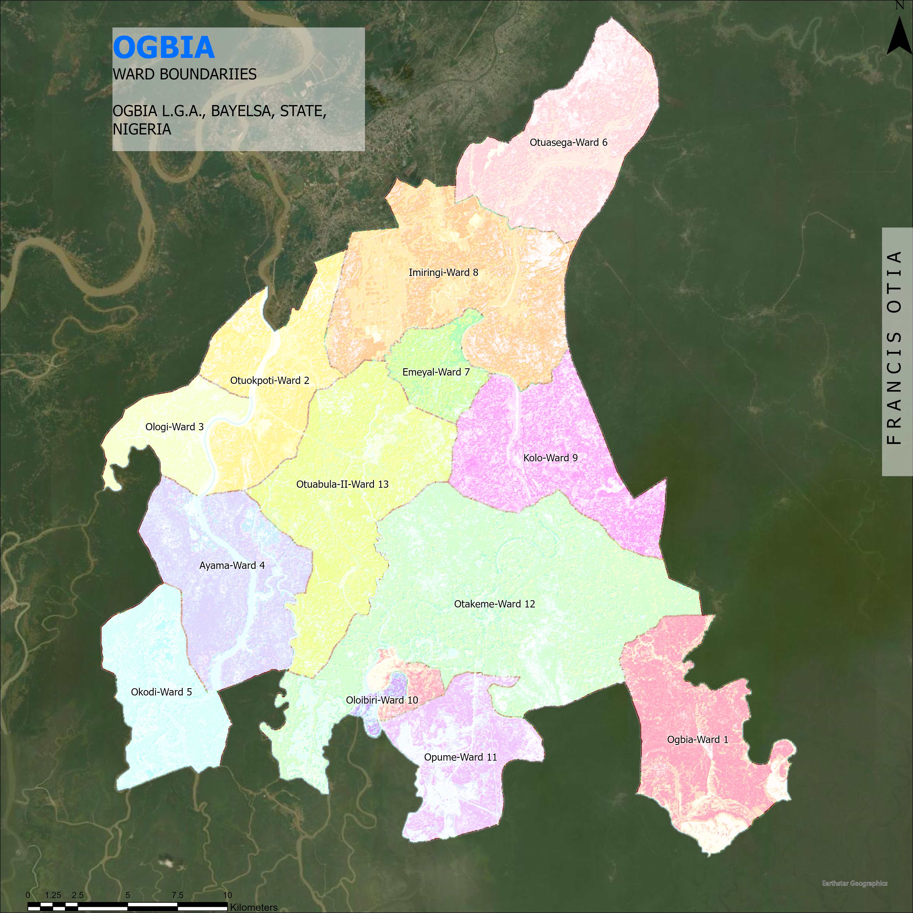

# My GeoDev Lab Africa project

Which settlements in Ogbia L.G.A., Bayelsa State, Nigeria sit in low-lying land within 200 metres of a watercourse?

Built over twelve months (From September 2026 - August 2027) with GeoDev Lab Africa, Cohort One.

### Kindly see the Project-brief.md for more details

## What we covered in Month 1
- [Week 1: Project-brief](Project-brief.md)
- [Week 2: Data-notes](data-notes.md)
- [Week 3: Data-preparation](data-preparation.md)
- [Week 4: month-1-summary](month-1-summary.md)

## Study Area Map

## Month 2: Development environment and early python
- Week 5: Set up PYTHON, VS Code and the terminal. `hello.py` runs
- cat shows a file content e.g. `cat hello.py`
- cp copies a file e.g `cp hello.py hello_copy.py`
- mv renames a file e.g. `mv hello_copy.py renamed.py`
